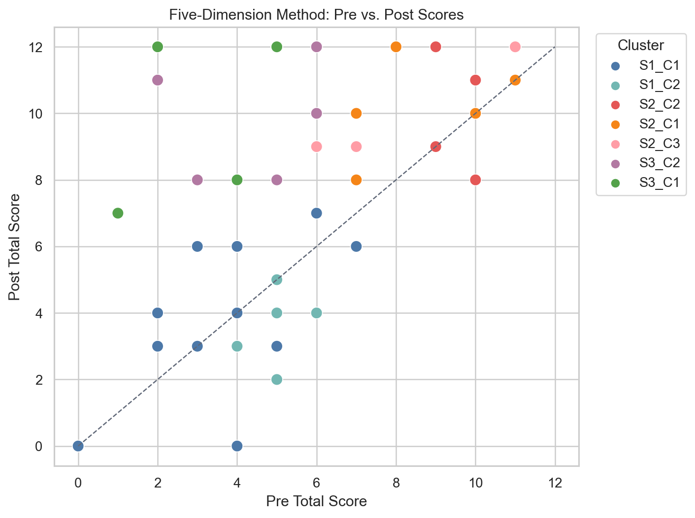
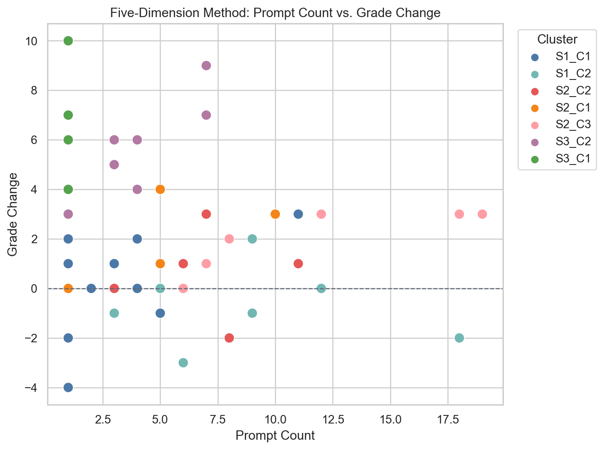
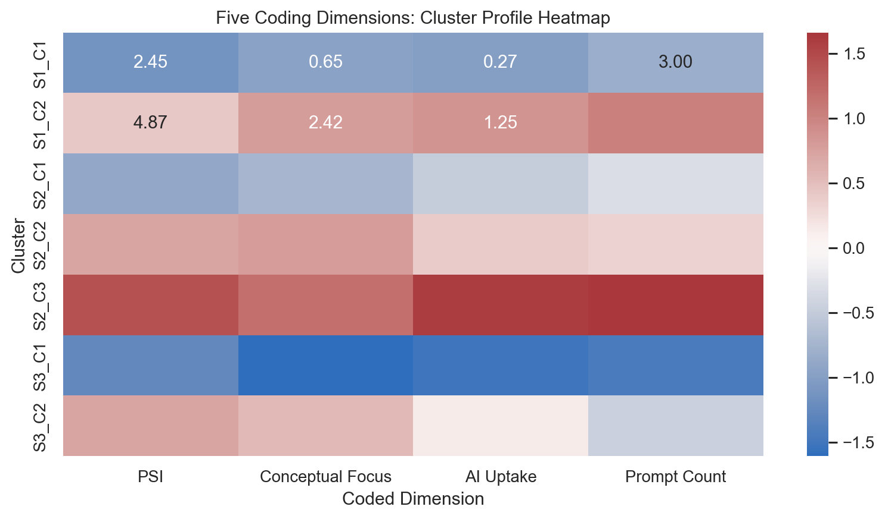
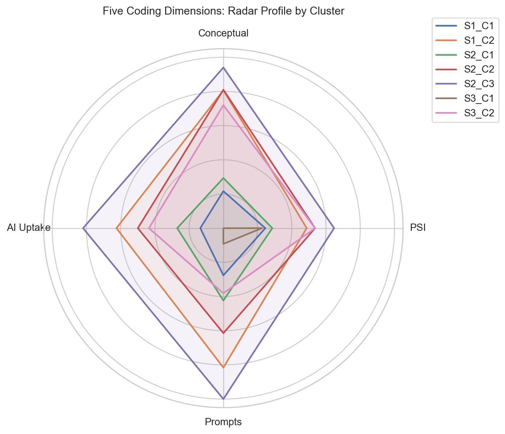
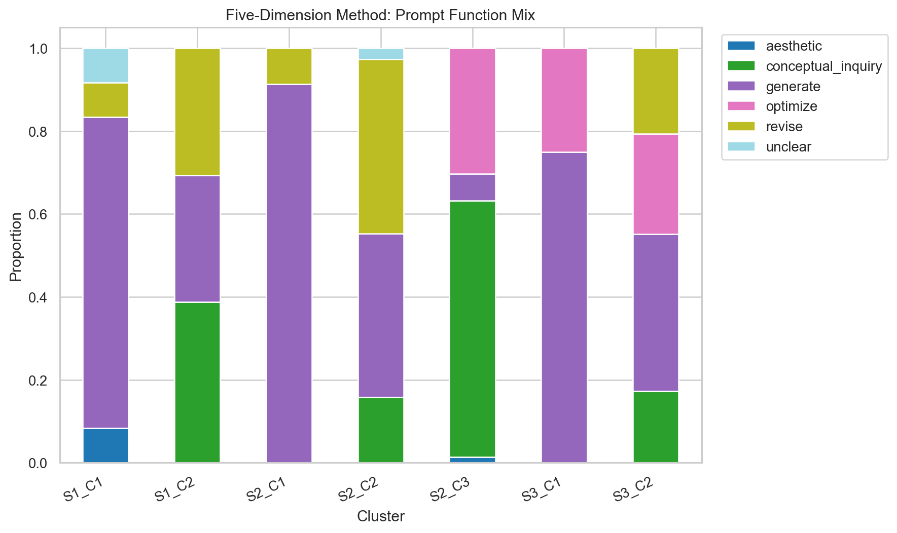
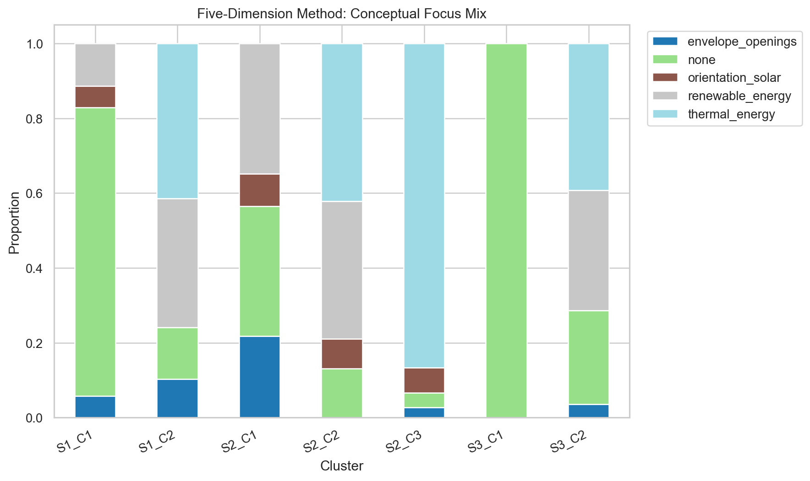
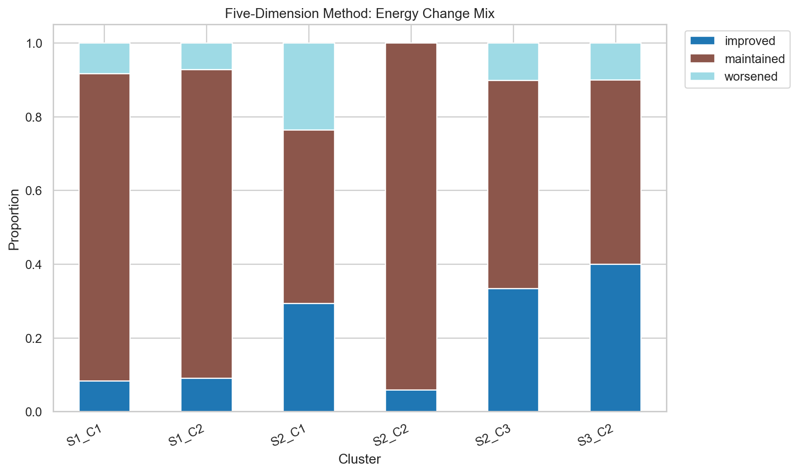

# Two-Stage Clustering Report (five coding dimensions)

Stage 1 clusters students by pre/post score trajectory. Stage 2 clusters students within each score trajectory using the five coded prompt dimensions rather than raw prompt text.

Clusterable students: 48
Stage 1 silhouette: 0.441

## Stage 2 Models

- S1: k=2, silhouette=0.251
- S2: k=3, silhouette=0.183
- S3: k=2, silhouette=0.316

## Cluster Summary

- S1_C1: n=12, avg pre=3.75, avg post=3.92, avg change=0.17, avg PSI=2.45, conceptual=0.65, uptake=0.27; functions=generate:27; unclear:3; aesthetic:3; revise:3; concepts=none:27; renewable_energy:4; orientation_solar:2; envelope_openings:2; energy=maintained:20; improved:2; worsened:2
- S1_C2: n=7, avg pre=4.14, avg post=3.43, avg change=-0.71, avg PSI=4.87, conceptual=2.42, uptake=1.25; functions=conceptual_inquiry:24; revise:19; generate:19; concepts=thermal_energy:24; renewable_energy:20; none:8; envelope_openings:6; energy=maintained:46; improved:5; worsened:4
- S2_C1: n=5, avg pre=8.6, avg post=10.2, avg change=1.6, avg PSI=2.86, conceptual=0.88, uptake=0.54; functions=generate:21; revise:2; concepts=renewable_energy:8; none:8; envelope_openings:5; orientation_solar:2; energy=maintained:8; improved:5; worsened:4
- S2_C2: n=6, avg pre=9.67, avg post=10.17, avg change=0.5, avg PSI=5.36, conceptual=2.43, uptake=1.0; functions=revise:16; generate:15; conceptual_inquiry:6; unclear:1; concepts=thermal_energy:16; renewable_energy:14; none:5; orientation_solar:3; energy=maintained:32; improved:2
- S2_C3: n=7, avg pre=8.29, avg post=10.0, avg change=1.71, avg PSI=6.47, conceptual=2.82, uptake=1.64; functions=conceptual_inquiry:47; optimize:23; generate:5; aesthetic:1; concepts=thermal_energy:65; orientation_solar:5; none:3; envelope_openings:2; energy=maintained:39; improved:23; worsened:7
- S3_C1: n=4, avg pre=3.0, avg post=9.75, avg change=6.75, avg PSI=2.25, conceptual=0.0, uptake=0.0; functions=generate:3; optimize:1; concepts=none:4; energy=
- S3_C2: n=7, avg pre=4.71, avg post=10.43, avg change=5.71, avg PSI=5.36, conceptual=2.16, uptake=0.87; functions=generate:11; optimize:7; revise:6; conceptual_inquiry:5; concepts=thermal_energy:11; renewable_energy:9; none:7; envelope_openings:1; energy=maintained:10; improved:8; worsened:2

## Interpretation

This version is the most interpretable of the three approaches because the prompt stage is based on explicit theoretical dimensions. The cluster labels can be read as score trajectory plus prompt behavior profile.

The main analytic advantage is that it separates prompt quantity from prompt quality. PSI, conceptual focus, AI uptake, and energy outcome can be compared directly against pre/post learning gains.

### Cluster Meanings

S1_C1: Low-score, low-growth, low-sophistication generators

This group had low pre/post performance but slight average gain. Their average PSI was low (2.45/10), conceptual focus was low (0.65/3), and AI uptake was low (0.27/2). Most prompts were simple generation prompts, and most had no conceptual focus. Interpretation: these students mostly asked the AI to make or generate designs, with limited evidence of scientific reasoning or uptake of AI explanations.

S1_C2: Low-score, negative-growth, concept-heavy but possibly unfocused iterators

This group had low pre/post performance and negative average change. Their PSI was higher (4.87/10), conceptual focus was high (2.42/3), and AI uptake was higher (1.25/2). They used more conceptual inquiry and revision prompts, especially around thermal energy and renewable energy. Interpretation: these students engaged with more scientific language, but that did not translate into assessment gains. This may indicate partial or surface-level uptake of concepts, confusion, or prompts that used scientific terms without stable understanding.

S2_C1: High-performing, lower-sophistication design generators

This group started high and improved modestly. Their PSI (2.86/10), conceptual focus (0.88/3), and AI uptake (0.54/2) were relatively low. Their prompts were mostly generation-oriented. Interpretation: these students may already have understood the content, so their prompts did not need to be highly sophisticated to maintain strong performance.

S2_C2: High-performing, balanced revisers

This group had high pre/post scores with small gains. PSI was moderate-high (5.36/10), conceptual focus was high (2.43/3), and AI uptake was moderate (1.00/2). Prompt functions mixed revise and generate, and conceptual focus centered on thermal and renewable energy. Interpretation: these students used the tool in a balanced design-revision mode, connecting prompts to energy ideas while maintaining already-strong performance.

S2_C3: High-performing, high-sophistication conceptual optimizers

This group had high scores and meaningful gains. It had the strongest prompt profile among high-performing students: PSI 6.47/10, conceptual focus 2.82/3, and AI uptake 1.64/2. Prompt functions included many conceptual inquiry and optimization prompts, and this group had the most improved energy-change moves. Interpretation: this is the clearest example of productive AI-supported reasoning: students asked more conceptual/optimization-oriented prompts, incorporated AI reasoning, and made more energy-improving design changes.

S3_C1: Strong-growth, low-coded-prompt students

This group had the strongest average score gain (+6.75) despite low PSI (2.25/10), no coded conceptual focus, and no coded AI uptake. Interpretation: their learning gains may have come from sources outside the prompt text, such as class instruction, peer support, prior activities, or concise prompts that the rule-based coding did not capture well.

S3_C2: Strong-growth, conceptually engaged improvers

This group also had strong gains (+5.71) and a much richer prompt profile: PSI 5.36/10, conceptual focus 2.16/3, and AI uptake 0.87/2. They used generation, optimization, revision, and conceptual inquiry prompts, with thermal and renewable-energy focus. Interpretation: these students show the pattern most aligned with the theory of learning through AI-supported design: they began lower, improved substantially, and their prompts reflected meaningful engagement with energy concepts.

### Main Research Takeaway

Using the five coding dimensions gives a more theoretically meaningful analysis than clustering raw prompt text alone. The results suggest that prompt quality matters, but its relationship with learning is not simple.

For high-performing students, the strongest cluster was S2_C3: high PSI, high conceptual focus, high AI uptake, and more energy-improving design moves. For lower-starting students, S3_C2 suggests that conceptual engagement and AI uptake can accompany large learning gains. However, S3_C1 reminds us that some students improved despite low coded prompt sophistication, so prompt data should be interpreted alongside classroom context and other evidence.

## Possible Visualizations

- Five-dimension radar chart by cluster: plot average PSI, conceptual focus, AI reasoning uptake, prompt count, and energy-improvement rate for each five-dimension cluster. This is the clearest visual summary of the coding-based approach.
- Clustered heatmap of coded dimensions: rows are clusters and columns are coded features such as PSI, conceptual focus, AI uptake, generate rate, revise rate, optimize rate, conceptual inquiry rate, improved-energy rate, and worsened-energy rate.
- Prompt function stacked bar chart: for each cluster, show the proportion of prompts coded as generate, revise, optimize, evaluate, conceptual inquiry, aesthetic, off-task, or unclear.
- Conceptual focus stacked bar chart: for each cluster, show the distribution of conceptual focus labels such as thermal energy, renewable energy, orientation/solar, envelope/openings, general sustainability, and none.
- Energy-change stacked bar chart: for each cluster, show the proportion of design moves that improved, worsened, or maintained net energy performance.
- PSI vs. grade-change scatterplot: plot each student's average PSI against grade change, color-coded by five-dimension cluster. This tests whether more sophisticated prompts are associated with learning gains.
- AI uptake vs. conceptual focus scatterplot: plot average AI reasoning uptake against average conceptual focus, with point size representing prompt count and color representing grade-change group.
- Pre/post slopegraph by cluster: draw one line per student from pre score to post score, grouped or faceted by five-dimension cluster. This makes individual learning trajectories visible inside each cluster.
- Coding reliability audit table: sample several prompts from each cluster with their five dimension codes, useful for human review and refinement of the rule-based coding scheme.

## Generated Visualizations

