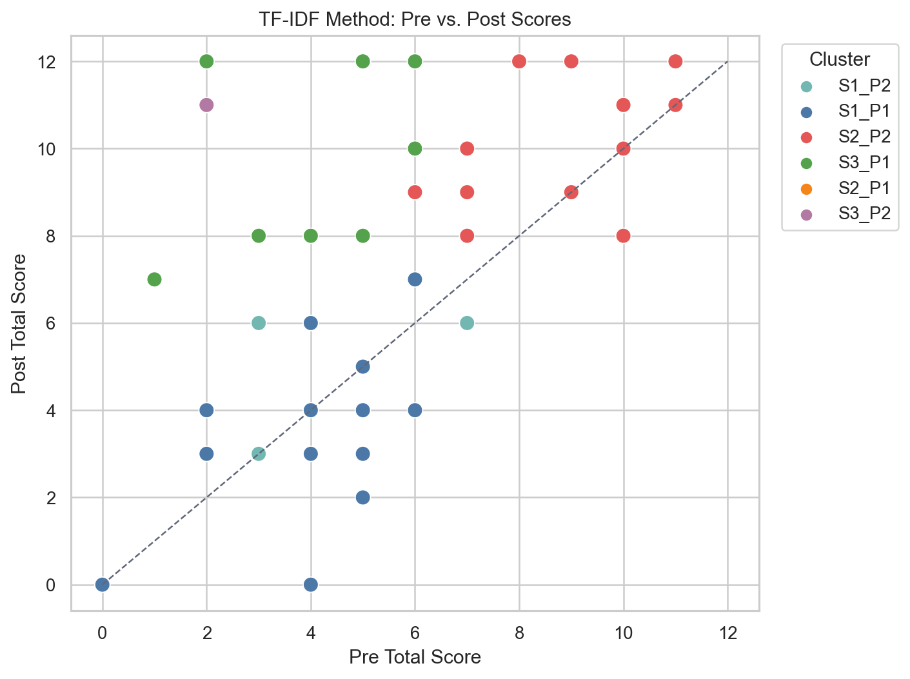
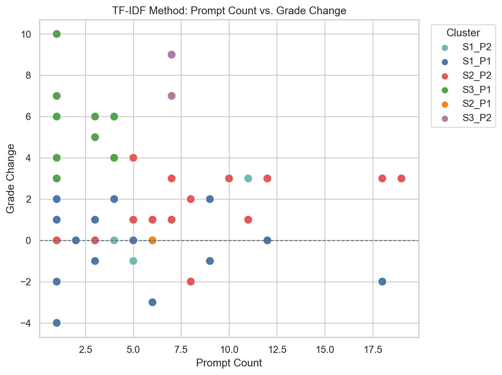
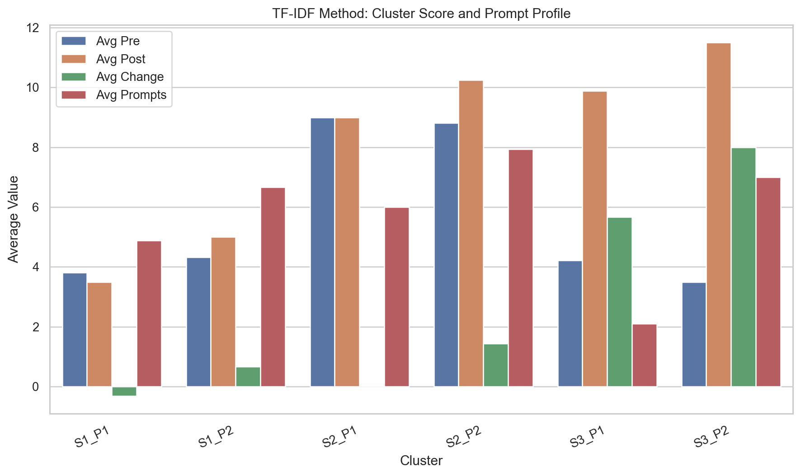
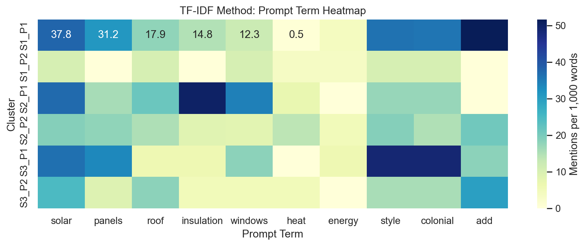

# Two-Stage Clustering Report (TF-IDF + engineered prompt features)

Stage 1 clusters students by standardized pre score, post score, and grade change.
Stage 2 clusters the concatenated `iteration_X_prompt` text within each Stage 1 score cluster.

Project rows: 75
Assessment rows: 130
Accepted project-to-assessment matches: 73
Clusterable rows with match, pre+post scores, and prompts: 48
Unmatched project rows: 2
Matched project rows without both pre/post: 21
Stage 1 selected k: 3 with silhouette 0.441

## Stage 2 Prompt Models

- S1: selected k=2, silhouette=0.199, vocabulary preview=style, colonial, generate, solar, make, panels, roof, add, white, windows, that, front, benson, big, insulation
- S2: selected k=2, silhouette=0.182, vocabulary preview=style, colonial, generate, solar, roof, panels, windows, add, both, walls, all, insulation, sides, window, make
- S3: selected k=2, silhouette=0.407, vocabulary preview=generate, style, colonial, solar, panels, insulation, windows, each, add, make, energy, side, roof, benson, heating

## Cluster Summary

- S1_P1: n=16, avg pre=3.81, avg post=3.5, avg change=-0.31; terms=add; solar; generate; style; colonial; panels; make; roof
- S1_P2: n=3, avg pre=4.33, avg post=5.0, avg change=0.67; terms=make; white; blue; small; colonial; style; roof; solar
- S2_P1: n=2, avg pre=9.0, avg post=9.0, avg change=0.0; terms=insulation; solar; windows; walls; roof; thermal; curtains; resisting
- S2_P2: n=16, avg pre=8.81, avg post=10.25, avg change=1.44; terms=add; solar; style; panels; roof; generate; colonial; heat
- S3_P1: n=9, avg pre=4.22, avg post=9.89, avg change=5.67; terms=generate; colonial; style; solar; panels; windows; add; tree
- S3_P2: n=2, avg pre=3.5, avg post=11.5, avg change=8.0; terms=add; value; m2c; solar; width; color; generate; roof

## Interpretation

### Big Picture

The first stage separates students by learning-score trajectory:

- S1: low pre, low post, little or no improvement
- S2: high pre, high post, stable or modest improvement
- S3: lower pre, much higher post, strong improvement

The second stage then asks: within each score pattern, what kind of `iteration_X_prompt` behavior appears?

### Cluster Meanings

S1_P1: Low-score, low-growth iterative builders

This cluster includes 16 students with an average pre score of 3.81, average post score of 3.50, and average change of -0.31. Their prompts often mention adding solar panels, generating colonial style, roofs, and general "make/add" edits. These students used iteration, but the prompt work looks mostly feature-additive or surface/design oriented, and it did not correspond with assessment growth.

S1_P2: Low-score, slight-growth style/detail builders

This cluster includes 3 students with an average pre score of 4.33, average post score of 5.00, and average change of +0.67. Their prompts emphasize color, size, style, roof, and solar. This is a similar low-performing group, but with slightly more improvement and more specific visual/detail language.

S2_P1: High-score stable efficiency-focused students

This cluster includes 2 students with an average pre score of 9.00, average post score of 9.00, and average change of 0.00. Their prompts emphasize insulation, solar, windows, walls, thermal curtains, and heat resistance. These students already had strong assessment knowledge and used prompts around energy-efficiency concepts. This is a small group, but semantically it is one of the clearest clusters.

S2_P2: High-score, modest-growth active designers

This cluster includes 16 students with an average pre score of 8.81, average post score of 10.25, and average change of +1.44. Their prompts include solar, panels, roof, heat, colonial style, and repeated add/generate language. These students started strong and improved some. Their prompt behavior suggests broad design iteration, mixing energy features with aesthetic/style changes.

S3_P1: Strong-growth, short-prompt improvers

This cluster includes 9 students with an average pre score of 4.22, average post score of 9.89, and average change of +5.67. They had fewer prompts on average, about 2.11, but terms still include colonial style, solar panels, windows, and add/generate. These students improved a lot despite fewer iterations. Their prompts may have been concise but effective, or their learning gains may have come from factors outside prompt quantity.

S3_P2: Strongest-growth, more technical/design-parameter improvers

This cluster includes 2 students with an average pre score of 3.50, average post score of 11.50, and average change of +8.00. Their prompts include value, width, color, roof, solar, and design-parameter language. This is a tiny group, but potentially interesting: these students showed the biggest assessment gains and their prompts look more parameter-oriented or construction-specific.

### Main Research Takeaway

The clusters suggest that prompt iteration quantity alone is not the main story. The strongest improvers were in S3, and one subgroup had very few prompts, while another had more technical parameter language. Meanwhile, some low-growth students iterated several times but mostly around adding visible features like solar panels, roofs, and style.

The stronger interpretation is that students' learning gains may relate less to how many prompts they wrote and more to the kind of reasoning embedded in the prompts. Energy-efficiency concepts, parameter changes, and design constraints may be more meaningful than generic feature additions.

## Possible Visualizations

- Pre/post score trajectory scatterplot: plot pre score on the x-axis and post score on the y-axis, color-coded by Stage 1 cluster. Add a diagonal reference line where pre equals post so growth and decline are visually clear.
- Grade-change distribution by two-stage cluster: use a boxplot or violin plot to compare grade change across S1_P1, S1_P2, S2_P1, S2_P2, S3_P1, and S3_P2.
- Prompt-count vs. grade-change scatterplot: plot prompt count on the x-axis and grade change on the y-axis, color-coded by two-stage cluster. This directly illustrates whether more prompting corresponds to more learning growth.
- Cluster profile bar chart: for each two-stage cluster, show average pre score, post score, grade change, prompt count, and total iterations as grouped bars.
- Top prompt terms heatmap: rows are clusters and columns are high-frequency prompt terms such as solar, panels, roof, insulation, windows, heat, style, and colonial. Cell values show term frequency or normalized term rate.
- Student-level cluster table: a compact sortable table with student/project name, pre score, post score, grade change, prompt count, and two-stage cluster.
- Sankey or alluvial diagram: show the flow from Stage 1 score cluster to Stage 2 prompt cluster, making it easy to see how each score group split by prompt behavior.

## Generated Visualizations

