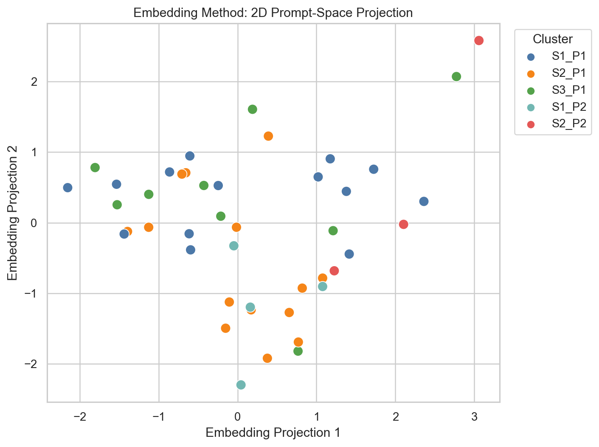
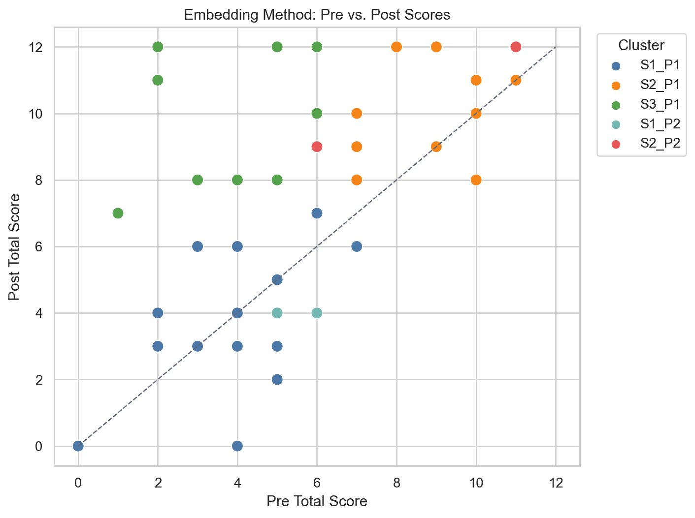
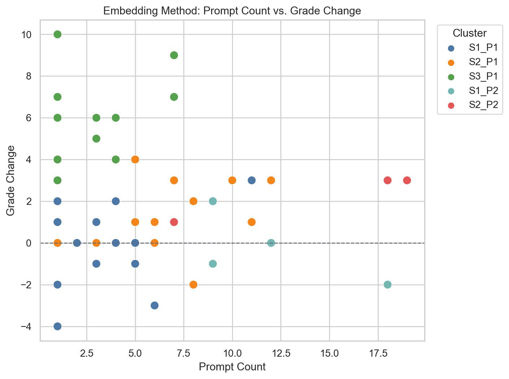
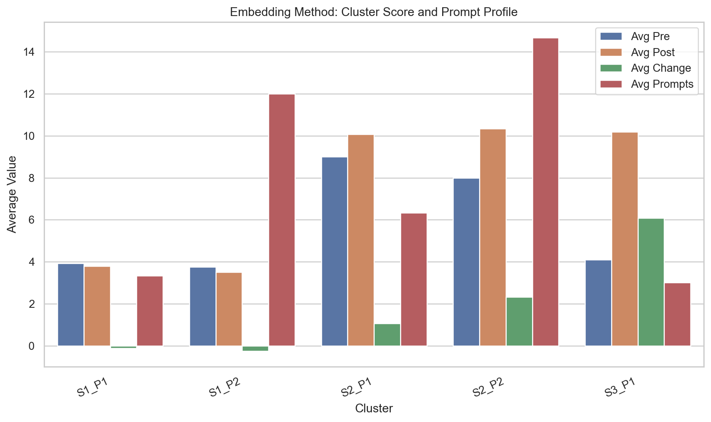

# Two-Stage Clustering Report (embedding)

Stage 1 clusters students by standardized pre score, post score, and grade change.
Stage 2 clusters dense prompt embeddings from the concatenated `iteration_X_prompt` text within each Stage 1 score cluster.

Prompt embedding method: local TF-IDF with unigrams/bigrams, reduced into dense latent semantic vectors using TruncatedSVD, plus prompt-behavior features such as prompt count, average length, total iterations, and thematic keyword counts.

Project rows: 75
Assessment rows: 130
Accepted project-to-assessment matches: 73
Clusterable rows with match, pre+post scores, and prompts: 48
Unmatched project rows: 2
Matched project rows without both pre/post: 21
Stage 1 selected k: 3 with silhouette 0.441

## Stage 2 Prompt Models

- S1: selected k=2, silhouette=0.346, vocabulary preview=100, 100 solar, 100 wind, 16m, 16m generate, 16m make, 73, 73 generate, add, add 100, add battery, add both, add castle, add electric, add fans
- S2: selected k=2, silhouette=0.45, vocabulary preview=13, 14, 16, 18, 20, 20 cooling, 24, 25, 25 ac, 335, 335 blk, 73d8ff, 73d8ff heating, ac, ac coefficient
- S3: selected k=1, silhouette=-1.0, vocabulary preview=10, 10 solar, 10m, 10m height, 12, 12 width, 20, 20 cooling, 22, 22 length, 25, 25 ac, 335, 335 blk, 454769

## Cluster Summary

- S1_P1: n=15, avg pre=3.93, avg post=3.8, avg change=-0.13; terms=style; colonial; generate; make; solar; panels; roof; big
- S1_P2: n=4, avg pre=3.75, avg post=3.5, avg change=-0.25; terms=add; solar; generate; colonial; style; panels; make; roof
- S2_P1: n=15, avg pre=9.0, avg post=10.07, avg change=1.07; terms=style; colonial; solar; generate; roof; panels; insulation; windows
- S2_P2: n=3, avg pre=8.0, avg post=10.33, avg change=2.33; terms=add; heat; solar; value; panels; room; living; make
- S3_P1: n=11, avg pre=4.09, avg post=10.18, avg change=6.09; terms=generate; solar; add; colonial; style; value; m2c; panels

## Interpretation

The embedding version keeps the same Stage 1 score trajectories as the original analysis:

- S1: low pre/post performance with little or no growth
- S2: high pre/post performance with modest growth
- S3: lower pre performance followed by strong post-test gains

The embedding method changes the Stage 2 prompt grouping. Instead of splitting students mainly by exact keywords, it groups students by denser latent prompt patterns, while still including prompt-count and iteration features.

S1_P1: Low-growth, shorter/general design prompts

This group includes 15 students with average pre 3.93, post 3.80, and change -0.13. Their prompts are generally about style, colonial design, solar panels, roofs, and making/generating objects. They averaged 3.33 prompts. Interpretation: these students used some design iteration, but their prompt behavior appears broad and feature-oriented, and it did not translate into assessment growth.

S1_P2: Low-growth, high-iteration feature adders

This group includes 4 students with average pre 3.75, post 3.50, and change -0.25. They averaged 12 prompts, much higher than S1_P1, and their terms emphasize adding solar, panels, roofs, and style features. Interpretation: this is an important contrast group. More iterations did not correspond to higher learning gains; these students iterated a lot, but mostly through repeated feature additions.

S2_P1: High-performing, moderate-iteration design/energy students

This group includes 15 students with average pre 9.00, post 10.07, and change +1.07. They averaged 6.33 prompts and used language around style, colonial design, solar, roofs, panels, insulation, and windows. Interpretation: these students entered with stronger knowledge and showed modest growth while using a balanced mix of aesthetic and energy-related prompts.

S2_P2: High-performing, high-iteration technical expanders

This group includes 3 students with average pre 8.00, post 10.33, and change +2.33. They averaged 14.67 prompts and used terms such as add, heat, solar, value, panels, room, and living. Interpretation: this small subgroup suggests that among already-strong students, heavier iteration may be associated with more design expansion and slightly larger gains.

S3_P1: Strong-growth students

This group includes 11 students with average pre 4.09, post 10.18, and change +6.09. They averaged 3 prompts, and their prompt terms include generate, solar, add, colonial style, value, m2c, and panels. Interpretation: these students improved substantially despite relatively few prompts. Their gains may be connected to prompt quality, classroom learning, or conceptual engagement rather than prompt quantity alone.

## Main Takeaway From The Embedding Version

The embedding version strengthens one finding from the original analysis: the number of prompt iterations is not enough to explain learning gains. In S1, a high-iteration subgroup still showed low or negative growth. In S3, students showed the strongest growth with only about 3 prompts on average.

The more useful interpretation is that learning gains may depend on the substance of the interaction: whether students use prompts to reason about energy, dimensions, values, heat, insulation, or design constraints, rather than simply adding visible design features.

## Possible Visualizations

- Embedding projection plot: reduce the dense prompt vectors to 2D with PCA, UMAP, or t-SNE, then color points by embedding cluster. This shows whether the prompt clusters are visually separated in semantic space.
- Pre/post score trajectory scatterplot: plot pre score vs. post score and color points by the embedding-based two-stage cluster. This connects semantic prompt grouping back to learning outcomes.
- Prompt-count vs. grade-change scatterplot: plot prompt count against grade change, color-coded by cluster. This highlights the contrast between high-iteration low-growth groups and lower-iteration strong-growth groups.
- Cluster centroid radar chart: show each cluster's average prompt count, average prompt length, total iterations, solar keyword rate, HVAC/heat keyword rate, efficiency keyword rate, and window/door keyword rate.
- Cluster silhouette bar chart: show the Stage 2 silhouette score for S1, S2, and S3. This communicates where the embedding method produced stronger or weaker separation.
- Top semantic terms per cluster: show the top TF-IDF terms or bigrams associated with each embedding cluster in a faceted horizontal bar chart.
- Comparison matrix with TF-IDF clusters: create a cross-tab heatmap comparing student assignments from the TF-IDF method and the embedding method to show where the two methods agree or diverge.

## Generated Visualizations

